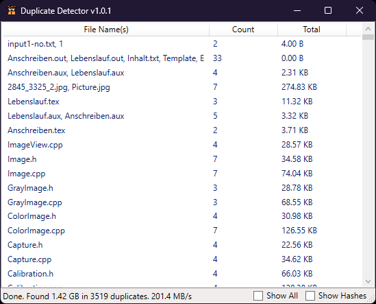

# Overview
Searches a path recursively for files with identical contents.



# Building from source

## Prerequisites
- [Microsoft .NET 8.0](https://dotnet.microsoft.com/en-us/download/dotnet/8.0) (Most likely, you'll need the SDK Installer for Windows x64)

## 

To download the sources and build, run the following lines from the PowerShell or similar:
```
git clone https://github.com/fhuber83/DuplicateDetector
cd DuplicateDetector
dotnet build --configuration Release
```

The binary will be placed under `bin\Release\net8.0-windows\`, relative to the folder you've just cloned into. To test if the program works, run the following line from the same Shell you just used:

```
.\bin\Release\net8.0-windows\DuplicateDetector.exe
```
